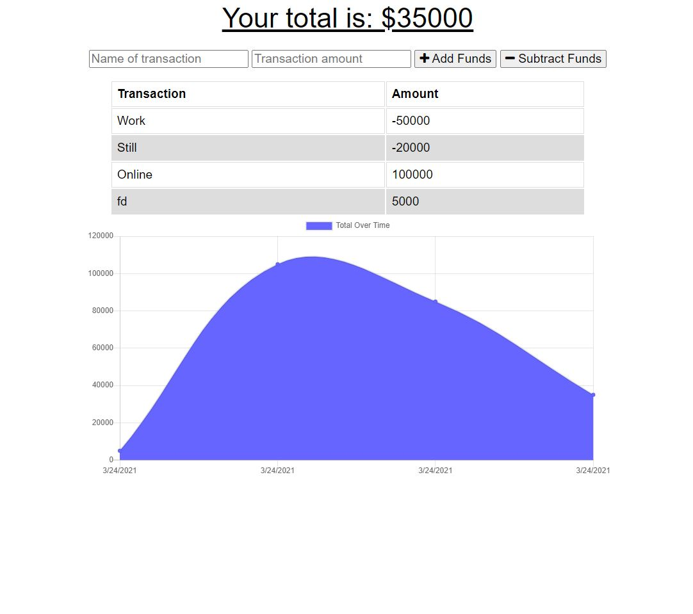

# Budget-Tracker

## Description

The user can add expenses and deposits to their budget with or without a connection. When entering transactions offline, the total will populate when brought back online.

## Developer 
 
 

Link to Deployment: [Budget Tracker](https://dry-inlet-95019.herokuapp.com/)

## Fucntionality

## Bugs and Issues
Found a bug? Review any [open issues][open-issues] or create a [new issues here][new-issue] so we can fix it for you!

## License
This application does not hold any licenses.

[open-issues]: https://github.com/dbridgman1/Budget-Tracker/issues
[new-issue]: https://github.com/dbridgman1/Budget-Tracker/issues/new